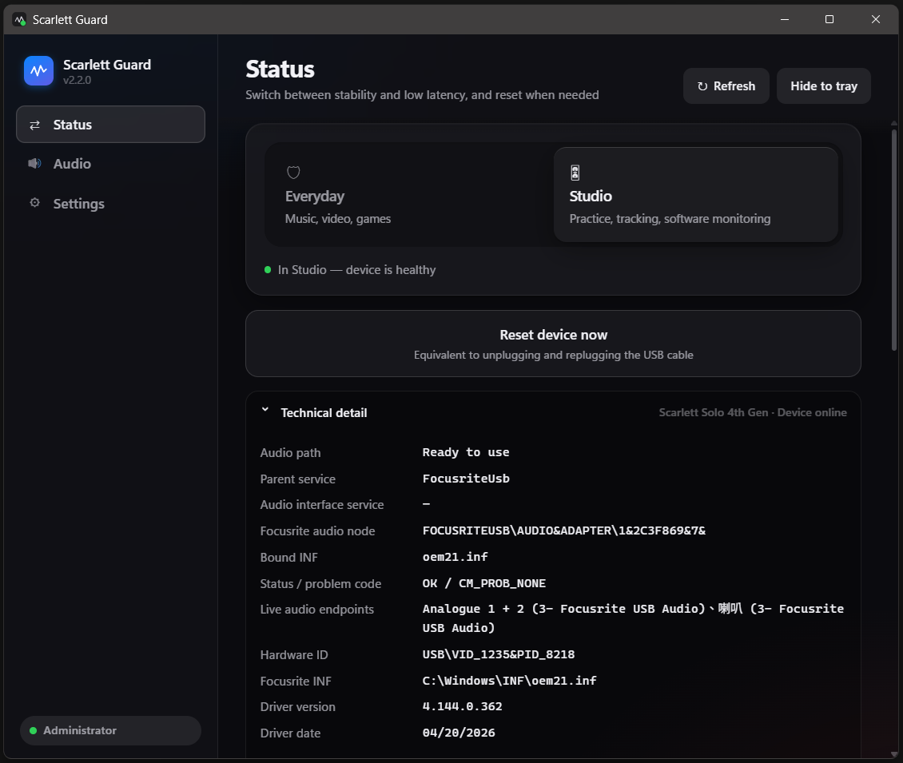
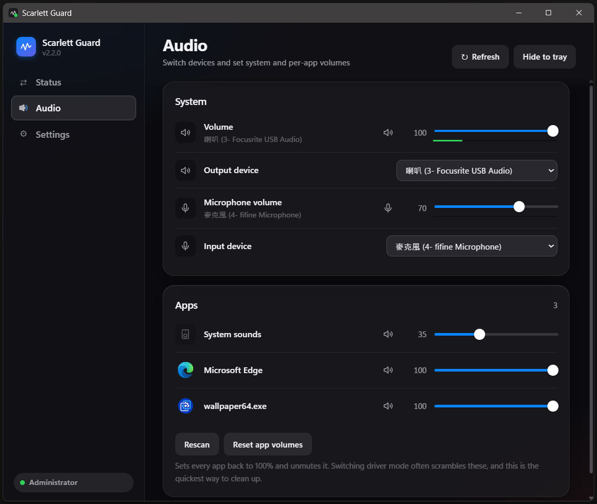

<div align="center">
  <p><b>English</b> · <a href="README.zh-TW.md">繁體中文</a></p>
  <br>
  <h1>Scarlett Guard</h1>
  <p>One-click switching between Everyday and Studio mode on a Focusrite Scarlett, so driver failures stop affecting your day-to-day use.</p>
  <p>
    <a href="https://github.com/asd880921/scarlett-guard/releases/latest/download/scarlett-guard.zip">
      
    </a>
  </p>
  <p>
    
    
  </p>
</div>

---

## Two modes, one click

| Mode | What it uses |
|---|---|
| **Everyday** | Windows' built-in `usbaudio2` driver |
| **Studio** | Focusrite's own ASIO driver |

**Both drivers stay installed. Switch whenever you like — no reinstalling drivers, no reboot, effective immediately.**

If the device locks up, **Reset device now** does the equivalent of replugging the USB cable, and a global hotkey triggers the same thing. *Technical detail* expands to show the driver binding, live audio endpoints and problem codes. Phantom device cleanup, the activity log and the language setting all live on the Settings page.



---

## Audio

System volume, microphone and every app's volume, all adjustable without opening Windows Settings. Switch the default output and input device from here, and each app is listed with its own icon so you can tell them apart at a glance. Switching driver mode often scrambles app volumes — **Reset app volumes** puts them all back to 100% in one click.



---

## Install

[Download `scarlett-guard.zip`](https://github.com/asd880921/scarlett-guard/releases/latest/download/scarlett-guard.zip), unzip it, then right-click `Scarlett Guard.exe` and **Run as administrator**. No Python needed.

> Unzip first. Don't run it from inside the archive.

Rebinding a driver requires administrator rights. The app won't throw a UAC prompt at you on launch — unelevated it still opens, only switching and reset are disabled, and a banner at the top lets you decide whether to relaunch.

Turn on **Start with Windows** in Settings and it will sit in the tray. That uses a Task Scheduler logon task, so you won't see UAC again after that.

---

## What this is for

Listening or recording through a Focusrite Scarlett, you occasionally hit an audio failure: continuous crackling, static, or the audio disappearing entirely. It usually can't recover on its own — you have to replug the USB cable, or change the sample rate in Focusrite Control 2, so the driver reloads and things go back to normal.

This kind of driver failure is a common complaint among Windows users. Simply removing the official Focusrite driver does reduce the disruption to everyday use, but it also costs you the low-latency recording that the official ASIO driver provides.


> ⚠️ **Don't uninstall Focusrite Audio Drivers**
>
> This tool needs the official Focusrite driver to stay installed in order to switch back to Studio mode and use the official ASIO.
> **Focusrite Audio Drivers** and **Focusrite Control 2** are two separate components. Even if you stay in Everyday mode indefinitely, neither adds background processes or system load.

---

## Settings and data

All settings and logs are stored in:

```text
%APPDATA%\ScarlettGuard\
```

The global hotkey uses `pynput` syntax (for example `<ctrl>+<alt>+r`) and is validated as you type; if a combination is invalid, it automatically reverts to the last one that worked.


---

## Known limitations

Windows only — it relies on `pnputil`, `newdev.dll` and Windows' PnP management commands.
Switching and resetting both interrupt an in-progress recording, the same as replugging USB.
This tool mitigates the symptom; it does not fix the driver itself.

---

## Licence

This project is licensed under the GNU General Public License v3.0 (GPL-3.0).
You are free to use, modify and distribute this software, but if you distribute a modified version, you must make the corresponding source code available under the GPL-3.0 terms.
See [LICENSE](LICENSE) for the full text.
